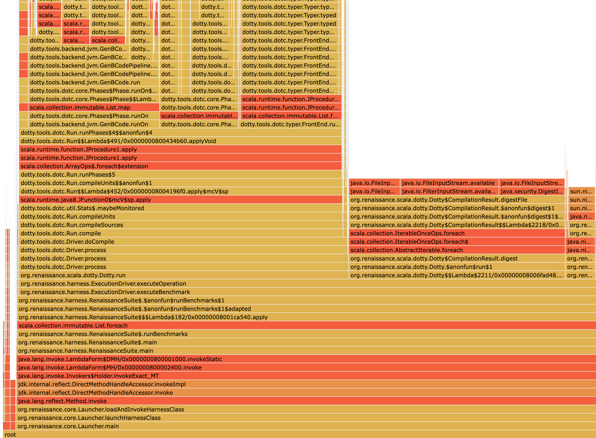

Tiny Profiler
=============

A tiny CPU profiler for Java written completely in Java 17.

This is an educational sampling profiler that helps demystify profilers, but is not limited to it.
 
This profiler is a sampling profiler with can output method tables and 
flame graphs (via [d3-flame-graph](https://github.com/spiermar/d3-flame-graph)).
The sampling is based on the `Thread.getAllStackTraces()` method, making it simple but also safepoint-biased.

The profiler should work on any platform with a JDK 17 or newer. The usage is fairly simple:

```sh
# build it
mvn package

# run your program and print the table of methods sorted by their sample count
# and the flame graph, taking a sample every 10ms
java -javaagent:target/tiny-profiler.jar=flamegraph=flame.html ...
```

Example:

```sh
# download a benchmark
> test -e renaissance.jar || wget https://github.com/renaissance-benchmarks/renaissance/releases/download/v0.14.2/renaissance-gpl-0.14.2.jar -O renaissance.jar

> java -javaagent:./target/tiny_profiler.jar=flamegraph=flame.html -jar renaissance.jar dotty
...
===== method table ======
Total samples: 11217
Method                                                          Samples Percentage     On top Percentage
dotty.tools.dotc.typer.Typer.typed                                59499     530.44          2       0.02
dotty.tools.dotc.typer.Typer.typedUnadapted                       31050     276.81          7       0.06
scala.runtime.function.JProcedure1.apply                          24283     216.48         13       0.12
dotty.tools.dotc.Driver.process                                   19012     169.49          0       0.00
dotty.tools.dotc.typer.Typer.typedUnnamed$1                       18774     167.37          7       0.06
dotty.tools.dotc.typer.Typer.typedExpr                            18072     161.11          0       0.00
scala.collection.immutable.List.foreach                           16271     145.06          3       0.03
...
```
This results in the following flamegraph:



The overhead for this example is around 2% on my MacBook Pro 13" for a 10ms interval, which makes the profiler usable
when you ignore the safepoint-bias.

Structure
---------
- Main class: Entry point of the Java agent
- Options: Parses and stores the agent options
- Profiler: Contains the profiling loop
- Store: Stores and outputs the collected results

License
-------
MIT, Copyright 2023 SAP SE or an SAP affiliate company, Johannes Bechberger
and tiny profiler contributors


*This project is a prototype of the [SapMachine](https://sapmachine.io) team
at [SAP SE](https://sap.com)*